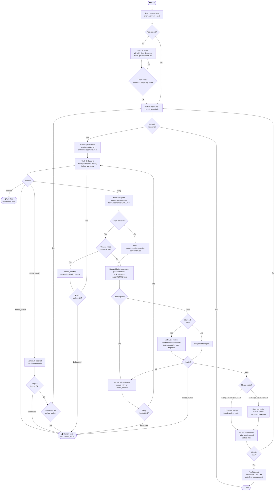

# Agentic Loop — How It Works

The agentic loop is an autonomous coding harness that turns a goal into small, safe tasks and executes them one at a time in isolated git worktrees. A fresh agent is spawned for each phase so context never bleeds between tasks.

---

## High-level phases

```
Goal
 │
 ▼
┌─────────────┐
│  Discovery  │  grill-with-docs: inspect repo, resolve decisions, stop for human input only when necessary
└──────┬──────┘
       │
       ▼
┌─────────────┐
│   Planning  │  split goal into small tasks, each assigned one canonical workflow
└──────┬──────┘
       │  (loop per task)
       ▼
┌─────────────┐
│  Task-Grill │  fresh agent: is the task still valid, scoped, and safe?
└──────┬──────┘
       │ ready / needs_replan / needs_human / blocked
       ▼
┌─────────────┐
│  Execution  │  fresh agent runs inside an isolated git worktree/branch
└──────┬──────┘
       │
       ▼
┌─────────────┐
│   Checks    │  run configured validation commands + task smoke tests
└──────┬──────┘
       │
       ▼
┌─────────────┐
│ Verification│  fresh verifier agent (or multi-vote for high-risk tasks)
└──────┬──────┘
       │ pass / fail / needs_human
       ▼
┌─────────────┐
│  Reflection │  persist lessons, handover notes, assumption updates
└──────┬──────┘
       │
       ▼
    Merge or
    hold for review
```

---

## Full loop — Mermaid flowchart



---

## What each phase does

### Discovery (Planner)
The planner uses `grill-with-docs` style reasoning: it restates the goal, inspects repo docs and code for evidence, and resolves decisions autonomously. It only stops for human input when a product or domain decision cannot be safely invented. The output is `agentic.json` with a task list and `grill-transcript.md` as a visible audit trail.

### Task-Grill
Before every executor turn, a fresh agent re-reads the repo and recent loop history and answers: *Is the task still understood, correctly scoped, and safe to execute right now?* Possible verdicts:

| Verdict | Harness action |
| --- | --- |
| `ready` | Inject result into executor prompt and proceed. |
| `needs_replan` | Mark task blocked, re-run planner, continue with replacement tasks. |
| `needs_human` | Stop before edits, surface the decision. |
| `blocked` | Stop before edits, record the blocker. |

### Execution
A fresh executor agent works inside an isolated git worktree on a dedicated branch. It reads `AGENTS.md`/`CLAUDE.md`, follows the canonical `SKILL.md` for the selected workflow (e.g. `tdd`, `diagnose`, `improve-codebase-architecture`), and produces a diff. The harness — not the agent — owns task status, merges, and cleanup.

### Checks
The harness runs every command in `agentic.json` `checks`, task `validation`, and CLI `--checks`. Commands may emit `METRIC key=value` lines for structured observability. Failures trigger retry (up to `--max-retries`) before escalating to `needs_human`.

### Scope rail
If a task declares a `scope` glob list, the harness diffs changed files after the executor and before the verifier. Any file outside scope is a retryable failure with the offending paths fed back into the next task-grill prompt. Tasks with no scope emit a warning but still proceed.

### Verification
A fresh verifier agent reads the task JSON, acceptance criteria, diff, checks output, and human-gate list from the policy. For high-risk tasks (implementation/architecture with a declared scope or matching a human-gate path), multiple independent "refute-first" verifier agents vote; a majority pass is required.

### Reflection
The harness persists `assumptionsStillValid`/`assumptionsChanged` back into `state.assumptions`, writes `handover.md` for future agents, and appends lifecycle events to `.agent-runs/events.jsonl`.

---

## Key files on disk

| File / Path | Purpose |
| --- | --- |
| `agentic.json` | Task graph and loop state for the current goal. |
| `.agent-runs/events.jsonl` | Append-only lifecycle event log (audit/debug). |
| `.agent-runs/<run>/grill-transcript.md` | Planner's visible Q&A and evidence trail. |
| `.agent-runs/<run>/task-grill.md` | Task-grill prompt (re-understanding gate). |
| `.agent-runs/<run>/task-grill-result.json` | Task-grill structured verdict. |
| `.agent-runs/<run>/executor.md` | Executor prompt (includes task JSON + task-grill result). |
| `.agent-runs/<run>/verifier.md` | Verifier prompt (includes diff, checks output, human gates). |
| `.agent-runs/<run>/verifier-result.json` | Verifier verdict: `pass`, `fail`, or `needs_human`. |
| `.agent-runs/<run>/handover.md` | Continuation note for the next agent turn. |
| `.agent-runs/<run>/failure-analysis.json` | Phase/attempt/reason/diff-stat on every failure. |
| `.worktrees/<task-id>/` | Isolated git worktree for one task's edits. |

---

## Safety defaults at a glance

- Main worktree stays clean — one task per isolated branch/worktree.
- Harness (not the executor) marks pass/fail and merges.
- Task-grill must return `ready` before any edits happen.
- Scope rail blocks out-of-scope file changes before the verifier sees them.
- Fast verifier requires low-risk task kind + declared scope.
- Retry budget prevents infinite loops; exhaustion escalates to `needs_human`.
- Replan budget + convergence detection prevent the planner from cycling.
- Human gates from `.agent-policy/workflow-policy.json` are checked by the verifier.

---

## Related docs

- [Root README](../README.md) — quick start, install, and which workflow to use
- [PROJECT.md](../PROJECT.md) — TS architecture map, module table, and validation coverage
- [agentic-loop SKILL.md](../skills/engineering/agentic-loop/SKILL.md) — skill contract and routing rules
- [scripts/agentic/README.md](../scripts/agentic/README.md) — legacy PowerShell harness command reference
- [ADR-0002](../adrs/0002-ts-agent-loop-autonomous-runner.md) — architecture decision for the TS runner
